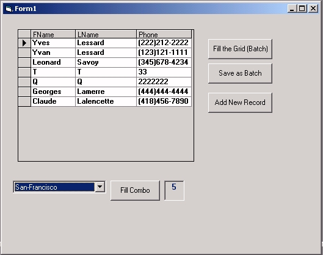



## AdoGeneric

### Description

I used this class for well over 2 years. It is easy. It comes with a simple program that show you how to use it. I am sure that once you will know how it is working that you will adopt it.
 
### More Info
 

             |
---                |---
**Submitted On**   |2001-07-20 04:11:46
**By**             |[Yves Lessard](https://github.com/Planet-Source-Code/PSCIndex/blob/master/ByAuthor/yves-lessard.md)
**Level**          |Intermediate
**User Rating**    |4.6 (32 globes from 7 users)
**Compatibility**  |VB 6\.0
**Category**       |[Databases/ Data Access/ DAO/ ADO](https://github.com/Planet-Source-Code/PSCIndex/blob/master/ByCategory/databases-data-access-dao-ado__1-6.md)
**World**          |[Visual Basic](https://github.com/Planet-Source-Code/PSCIndex/blob/master/ByWorld/visual-basic.md)
**Archive File**   |[AdoGeneric231857212001\.zip](https://github.com/Planet-Source-Code/yves-lessard-adogeneric__1-25244/archive/master.zip)

